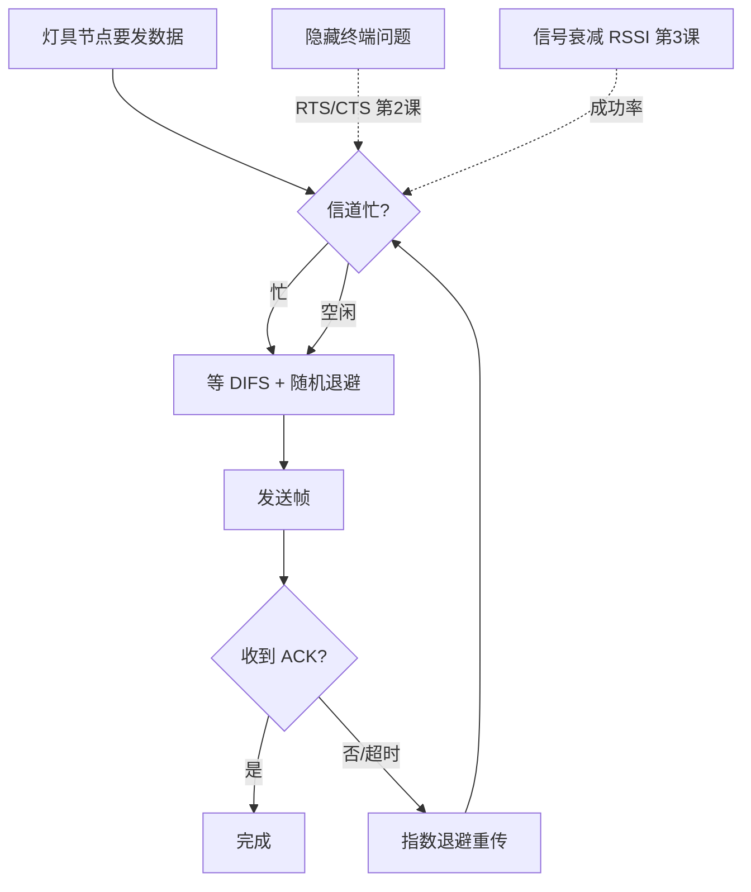

# U1 知识手册（CSMA/CA 与无线信道 · 项目伴随学习）

> 用途：学习/查阅——知识点常新常查。
> 配套：错题复习 → U1-quiz.md ｜ 过程回溯 → U1-review.md ｜ 复习调度 → PLAN/review-checklist.md §网络+边缘
> 阶段：gs-lighting 项目伴随学习（U = 交付单元，对齐 pair-learning D{N}-{主题} 结构）

## 目录

0. [学习者认知锚点](#0-学习者认知锚点)
1. [必答问题](#1-必答问题)
2. [第 1 课 为什么无线用 CSMA/CA 不用 CSMA/CD](#2-第-1-课-为什么无线用-csmaca-不用-csmacd)
3. [第 2 课 CSMA/CA 完整流程（待讲）](#3-第-2-课-csmaca-完整流程待讲)
4. [第 3 课 信号衰减与 RSSI（待讲）](#4-第-3-课-信号衰减与-rssi待讲)
5. [第 4 课 mesh.py 信道模型设计（反哺，待讲）](#5-第-4-课-meshpy-信道模型设计反哺待讲)
6. [总览图](#6-总览图)
7. [钩子池](#7-钩子池)
8. [误解纠正](#8-误解纠正)
9. [费曼](#9-费曼)

---

## 0. 学习者认知锚点

> 开课前摸底（先探基础）。讲解/类比直接复用。

- 已熟悉：Python、嵌入式 W1 底子（中断/事件驱动/防抖）、量化背景（cooldown/重试）、gs-lighting 项目
- 可当锚点：`防抖时间戳 = 非阻塞仲裁`（事件驱动）、`量化冷却 = 退避`、`webhook = 事件推送`
- 需降级：无线射频细节（同频自干扰/天线）→ 先讲直觉（对讲机模型）

## 1. 必答问题

> 开课时定 3-5 题，= 毕业验收清单：结课时原题复答。读完能答 = 掌握。

1. 为什么无线用 CSMA/CA 而不是 CSMA/CD？（半双工本质 + 隐藏终端）
2. CSMA/CA 完整流程：DIFS → 退避 → 发送 → ACK 四步各自解决什么问题？
3. 信号衰减怎么从「距离」走到「通信成功率」？mesh.py 的链路模型最少要几个参数？
4. mesh.py 信道模型的设计验收标准是什么？（冲突统计/退避可观察）

## 2. 第 1 课 为什么无线用 CSMA/CA 不用 CSMA/CD

> 场景：mesh.py 要模拟 20 个灯具节点共享 2.4G 频谱——两节点同时发 = 冲突。有线 vs 无线给出了两个答案。｜ 日期：08-20

**一句话本质**：有线能「撞了再发现」（CD），因为全双工可边发边听；无线只能「撞了靠避免」（CA），因为半双工听不见自己发、还有隐藏终端让侦听失效——所以用退避错峰 + ACK 兜底。

**讲解**：
- 有线以太网（CSMA/CD）：先听后发（CS）+ 多路访问（MA）+ **边发边听**（CD）——发送与监听线路独立（全双工介质），电压异常 = 撞了 → 停止 + jam 通知 + 随机退避重传
- 无线（802.11 CSMA/CA）：无线电同一频率**半双工**——发信号会淹没收信号（同频自干扰），**边发边听物理上不可能** → 冲突检测不了，只能**避免**（CA）→ 先听后发 + 空闲后等 DIFS + **随机退避错峰** + 接收方回 **ACK**，没收到 = 疑似冲突 → 重发
- **隐藏终端**：A→B 通信时，C 能听到 B 但听不到 A（距离/遮挡）→ C 侦听信道"空闲"就发 → B 处两路信号冲突。**先听后发在隐藏终端面前失效**（侦听范围 ≠ 冲突范围）

**类比**：有线 = 面对面聊天，说岔了当场听见纠正（CD）；无线 = 对讲机（PTT 按住才能说），同频只能一人说话，且隔墙的人听不到你占线——所以约定"说完等对方回'收到'，没收到过会儿重说"（CA + ACK）。（类比已入库）

**关键点**：
- CD 依赖「全双工边发边听」，无线半双工 → 物理上不可行
- CA 的本质 = 预防（错峰）+ 确认兜底（ACK）
- 隐藏终端让「先听后发」失效：侦听范围 ≠ 冲突范围

**项目落点**：mesh.py 信道层必须建模——不能只用「RSSI→成功率」简化，要加冲突/退避机制（第 4 课设计）。
**微题**：U1-quiz.md T1/T2/T3。
**钩子**：隐藏终端的标准解法 RTS/CTS 握手——第 2 课揭晓。

## 3. 第 2 课 CSMA/CA 完整流程（待讲）

> 场景：节点要发数据了，完整走一遍 802.11 的规矩。｜ 日期：待定

**一句话本质**：（待讲）

**讲解**：（待讲：DIFS / 随机退避（二进制指数）/ ACK 超时重传 / RTS-CTS 可选）

**类比**：（待讲，查画像库）

**关键点**：（待讲）

**项目落点**：（待讲）

**微题**：U1-quiz.md 追加批次。
**钩子**：（待定）

## 4. 第 3 课 信号衰减与 RSSI（待讲）

> 场景：mesh.py 链路模型——节点间距怎么变成通信成功率。｜ 日期：待定

**一句话本质**：（待讲：自由空间路径损耗 / RSSI 阈值 / 成功率映射）

**讲解**：（待讲）

**类比**：（待讲）

**关键点**：（待讲）

**项目落点**：（待讲）

**微题**：U1-quiz.md 追加批次。
**钩子**：（待定）

## 5. 第 4 课 mesh.py 信道模型设计（反哺，待讲）

> 场景：把 U1 学的机制落成 mesh.py 代码设计。｜ 日期：待定

**一句话本质**：（待讲）

**讲解**：（待讲：状态机设计 / 冲突统计口径 / ns-3 校准）

**类比**：（待讲）

**关键点**：（待讲）

**项目落点**：mesh.py 信道层实现（collab-flow workitem）。
**微题**：U1-quiz.md 追加批次。
**钩子**：（待定）

## 6. 总览图

> U1 毕业评审标准答案（综合设计题）。每课结课增量加节点，不突击画。

## 7. 钩子池

> 深入一问登记表。毕业评审从这里抽题组卷。揭晓后打 ✅。

| # | 问题 | 抛出课次 | 关联知识点 | 状态 |
|---|------|---------|-----------|------|
| 1 | 隐藏终端的标准解法 RTS/CTS 是什么？为什么能解决？ | 第 1 课 | CSMA/CA 流程 | 待揭晓 ⏳（第 2 课） |
| 2 | ns-3 的 802.11 模型和我们的简化模型差在哪？ | 第 1 课 | 链路建模 | 待揭晓 ⏳（第 4 课） |

## 8. 误解纠正

> 初学时的错误心智模型 → 被什么证据纠正。新错法在此追加 `#N`。

（暂无——等 T1/T2 批改后回填）

## 9. 费曼

> 一句话讲给外行：讲不清楚 = 没懂。

> 无线网络像对讲机：同一时间只能一个人说话，而且说话前要先听有没有人占线；但因为"隔墙听不见"，光听还不够，所以说完要等对方确认收到，没收到就换个时间重说。
