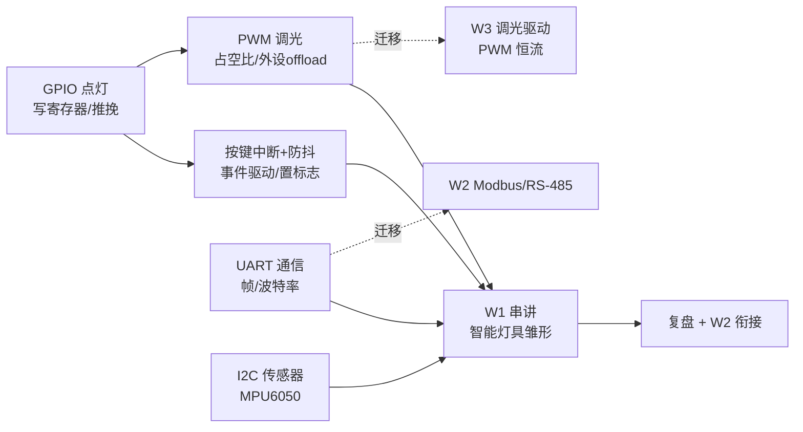

# W1 嵌入式知识手册（嵌入式手感唤醒）

> 用途：**学习/查阅**——知识点常新常查。
> 配套：错题复习 → `W1-quiz.md` ｜ 过程回溯 → `W1-review.md` ｜ 复习调度 → `../review-checklist.md` ｜ 概念卡 → `study-cards.md`
> 体系：pair-learning v2（三文件 + checklist + 画像库）

## 目录

0. [学习者认知锚点](#0-学习者认知锚点)
1. [必答问题](#1-必答问题)
2. [第 1 课 D1 GPIO](#2-第-1-课-d1-gpio)
3. [第 2 课 D2 中断](#3-第-2-课-d2-中断)
4. [第 3 课 D3 PWM](#4-第-3-课-d3-pwm)
5. [第 4-7 课 D4-D7（待开）](#5-第-4-7-课-d4-d7待开)
6. [W1 总览图](#6-w1-总览图)
7. [钩子池](#7-钩子池)
8. [误解纠正](#8-误解纠正)
9. [费曼](#9-费曼)

---

## 0. 学习者认知锚点

> 开课前摸底（先探基础）。讲解/类比直接复用。

- 已熟悉领域：爬虫（轮询/webhook）、量化（cooldown/去抖）、AI/大模型、独立站、AI 短剧
- 可直接当锚点：webhook（事件驱动）、生产者-消费者/MQ（解耦）、cooldown（去抖）、dict 操作（位掩码放大版）
- 需降级讲解：暂无重大项（术语先讲直觉再补理论精度）

## 1. 必答问题

> = 毕业验收清单：D6 结课时原题复答，答不出回炉。答完一题勾一题（进度条）。

1. **GPIO**：`digitalWrite(LED_PIN, HIGH)` 芯片里发生了什么？（寄存器 / 推挽 / 电流）——D1 已可答 ✅
2. **中断**：为什么「ISR 置标志 + 主循环消费」能满足 ISR 短 + 响应及时？丢事件本质是什么？——D2 已可答 ✅
3. **PWM**：占空比和频率是两个独立维度吗？LED 调光为什么选 PWM 不选调流？——D3 已可答 ✅
4. **UART**：两个设备通信，怎么知道一帧数据从哪开始、到哪结束？——D4 学完答 ⏳
5. **I2C**：总线上挂多个设备，怎么区分「在跟谁说话」？——D5 学完答 ⏳

## 2. 第 1 课 D1 GPIO

> 场景：ESP32 点灯 demo（F 仓 `labs/w1/D1-blink/`）。日期：2026-08-06。

**一句话本质**：`digitalWrite` 不是"给电压"，是**写寄存器**——`GPIO_OUT_REG |= (1<<2)`，推挽结构把引脚物理接到电源轨。

**讲解**：芯片内部推挽（两个 MOSFET）：HIGH=上管导通推上 3.3V、LOW=下管导通拉下 0V，纳秒级响应。LED 是**电流器件**（正向压降 ≈2V → 220Ω 限流 → 6mA），电阻 = 限流器，不串瞬间烧毁。逻辑电平（3.3V）由芯片供电/制程决定，与外部电阻无关。

**类比**：寄存器写 bit = dict 操作 / 位掩码的放大版（编程基础）。

**关键点**：
- 嵌入式本质 = 读写寄存器
- pinMode 必须先于读写（不配模式直接写 = 未定义行为）
- 混接坑：3.3V 设备接 5V 信号烧芯片；5V 设备读 3.3V 读不到 → level shifter（W2 RS-485 会遇到）

**项目落点**：控制层"灯亮/灭"的最基本执行单元——LED = 一盏灯的抽象，智能照明执行层从写寄存器开始。
**微题**：W1-quiz.md 批次 1。
**钩子**：Q4「LED 阳极直连 3.3V 永远亮，为什么不是可行的调光方案？」→ 答案 = PWM 占空比（D3 已揭晓 ✅）。

## 3. 第 2 课 D2 中断

> 场景：按键中断 + 防抖 demo（F 仓 `labs/w1/D2-interrupt/`）。日期：2026-08-06。

**一句话本质**：事件驱动——硬件在边沿变化**瞬间触发**（不是采样），把"硬件事件"降维成"内存状态"（置标志），消费从外设读变内存读（纳秒级）。

**讲解**：轮询是采样（只在查询瞬间看一眼，两次查询间电平变回 = 丢事件），中断是边沿触发（硬件监视不花 CPU）。置标志 = 原子级操作（32 位对齐读写硬件原子），满足 ISR 短；主循环消费内存标志，最坏响应 = 一个 loop 周期。volatile 判据 = 是否被**当前执行流之外**修改；const 编译期常量直接折叠连内存都不读。

**类比**：轮询 vs 中断 = 爬虫轮询 API vs webhook 推送；置标志 + 消费 = 生产者-消费者/MQ 解耦；防抖时间戳 = trade-pulse cooldown；触发 vs 有效 = webhook 每次都推 vs 消费端去重。

**关键点**：
- 轮询丢事件 = "没采样到"，不是"来不及处理"
- 防抖 = **时间过滤非阻塞判定**（时间戳），不是 delay 忙等（阻塞 + 吞真事件 + ISR 里看门狗复位）
- 中断由硬件**无条件触发**，时间戳是 ISR 内仲裁——**触发 ≠ 有效，硬件触发 vs 软件过滤两个层面**
- ISR 硬规则：禁 delay / Serial.print / malloc

**项目落点**：感知层按键接入（面板/按键）；事件驱动思维 = webhook 消费端设计。
**微题**：W1-quiz.md 批次 2。
**深入一问（已回收 ✅）**：RTOS 为什么秒响应？——事件**进队列**（ISR=生产者）+ 高优先级任务（消费者）+ vTaskDelay 让出 CPU（暂停自己不是暂停世界）；裸机下 ISR 置标志返回后主循环还在 delay 剩余时间，消费照样等（D6 展开）。

## 4. 第 3 课 D3 PWM

> 场景：PWM 调光呼吸灯 demo（F 仓 `labs/w1/D3-pwm/`，留例）。日期：2026-08-07/11。

**一句话本质**：占空比 = 亮度旋钮（平均光能 = 满亮 × 占空比），频率 = 闪烁消除器（视觉暂留下限 ~60Hz）；由 LEDC 硬件外设生成（CPU 只下单）。

**讲解**：1% ≈ 灭但**0% 才真灭**；20Hz < 视觉暂留 → 频闪（头晕/相机频闪带，IEEE 1789 行业指标）。调光三选：PWM 恒流（色温稳/效率 90%+/EMI 可修=工程问题）vs 模拟调流（色温漂/损耗大=原理问题）——**选"原理级优点+工程级缺点"的路**。分辨率：编码均匀 × 人眼对数感知（韦伯-费希纳）= 低端跳变可见；目标 = **感知均匀**（gamma/对数曲线：软件 LUT / DALI 对数 / 硬件 16bit）。

**类比**：ledcWrite（外设 offload）= webhook 式（注册一次硬件自动执行）；digitalWrite = 轮询式（CPU 每周期亲自参与）——呼应 D2 轮询 vs 中断，CPU 稀缺，能交给硬件的绝不自己干。

**关键点**：
- 两个独立维度：占空比→亮度，频率→闪烁，别混
- ledcWrite：CPU 参与一次（写占空比/CCR），不参与每周期翻转
- 16 通道、频率/分辨率独立可配 = W3 调光驱动底层肌肉
- 0-10V/DALI 是上层协议，底层肌肉 = PWM/恒流驱动

**项目落点**：控制层调光驱动底层机制（架构图"控制层深挖"节）；直接迁移照明中期目标（W3 PWM 恒流调光）。
**微题**：W1-quiz.md 批次 3。
**钩子**：16 通道 LEDC = W3 调光驱动底层肌肉（⏳ W3 揭晓）。

## 5. 第 4-7 课 D4-D7（待开）

- D4 UART 通信（通信层，Modbus 物理基础）——待开课
- D5 I2C 传感器（感知层，恒照度/人感前提）——待开课
- D6 主线串讲（毕业评审：必答问题 + 钩子池组卷）——待开
- D7 复盘 + W2 衔接（产出下一阶段输入）——待开

## 6. W1 总览图

> 增量维护（每课加节点）。完整五层架构图见 `architecture/00-system-overview.md`。

## 7. 钩子池

| # | 问题 | 抛出课次 | 关联知识点 | 状态 |
|---|------|---------|-----------|------|
| 1 | RTOS 为什么能秒响应（vs 裸机 delay 阻塞）？事件进队列 vs 置标志 | D2 深入一问 | 中断/RTOS | ✅ 已揭晓（D2） |
| 2 | 16 通道 LEDC = W3 调光驱动的底层肌肉 | D3 | PWM/LEDC | ⏳ W3 揭晓 |
| 3 | 两个设备通信，怎么知道一帧数据从哪开始、到哪结束？ | D4 | UART | ⏳ 待抛 |
| 4 | 总线上挂多个设备，怎么区分「在跟谁说话」？ | D5 | I2C | ⏳ 待抛 |

## 8. 误解纠正

> 初学时的错误心智模型 → 被什么证据纠正。新错法追加 `#N`（来源批次回链 quiz）。

1. **"HIGH 是 3.3V 因为电阻分压"** → 错。逻辑电平是芯片供电/制程决定，电阻分压是外部电路，两个层面。（来源：批次 1 Q3）
2. **"轮询丢事件 = 来不及处理"** → 错。是**没采样到**——两次查询间电平已变回。（来源：批次 2 Q1）
3. **"防抖 = 等一等再读（delay）"** → 错。delay = 忙等阻塞 + 时长拍脑袋 + 吞真事件；防抖 = 时间戳非阻塞判定。（来源：批次 2 Q4）
4. **"时间戳是触发开关"** → 错。中断每次下降沿硬件无条件触发，时间戳是 ISR 内仲裁：**触发 ≠ 有效**。（来源：批次 2 Q4）
5. **"占空比 1% = 灭"** → 错。平均光能 = 满亮 × 占空比，1% 接近灭但**0% 才真灭**。（来源：批次 3 Q1）
6. **"用模拟调流避开 PWM 的 EMI"** → 错。EMI 是工程问题可修；色温漂/效率损耗是原理问题无解——行业宁做 EMC 处理。（来源：批次 3 Q2）
7. **"8bit 低亮度跳变 = 编码太粗"** → 精确化。编码均匀 × 人眼对数感知（韦伯-费希纳）= 低端跳变可见；目标是感知均匀（gamma/对数曲线）。（来源：批次 3 Q4）
8. **"ledcWrite 完全不需要 CPU"** → 错。CPU 要参与一次（写占空比下单），只是不参与每周期翻转。（来源：批次 3 Q5）

## 9. 费曼

> 嵌入式 = 读写寄存器 + 事件驱动 + 外设 offload。W1 用 ESP32 把"一盏灯"从点亮（GPIO）到响应按键（中断）到呼吸调光（PWM），唤醒嵌入式手感——智能照明执行层的一切都从这三板斧长出来。
