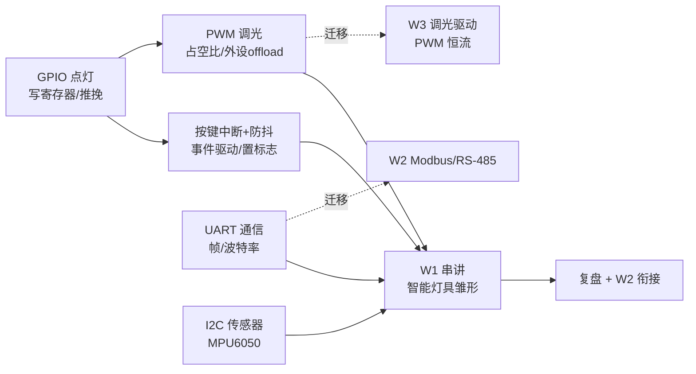

# W1 总览（串线控制台）

> pair-learning v2：W 级唯一文件——必答问题 / 钩子池 / 总览图 / D 进度 / 评审组卷指引。
> 各 D 三件套在 `D{N}-*/` 目录；复习调度 → `../review-checklist.md`；概念卡 → `study-cards.md`。

## W1 目标

唤醒嵌入式手感（GPIO/中断/PWM/UART/I2C），5 个 demo = 智能灯具雏形。→ W2 Modbus 主从。

## 必答问题（= 毕业验收清单，D6 原题复答）

1. **GPIO**：`digitalWrite(LED_PIN, HIGH)` 芯片里发生了什么？（寄存器 / 推挽 / 电流）——D1 已可答 ✅
2. **中断**：为什么「ISR 置标志 + 主循环消费」能满足 ISR 短 + 响应及时？丢事件本质是什么？——D2 已可答 ✅
3. **PWM**：占空比和频率是两个独立维度吗？LED 调光为什么选 PWM 不选调流？——D3 已可答 ✅
4. **UART**：两个设备通信，怎么知道一帧数据从哪开始、到哪结束？——D4 学完答 ⏳
5. **I2C**：总线上挂多个设备，怎么区分「在跟谁说话」？——D5 学完答 ⏳

## 钩子池（毕业评审组卷素材）

| # | 问题 | 抛出课次 | 关联知识点 | 状态 |
|---|------|---------|-----------|------|
| 1 | RTOS 为什么能秒响应（vs 裸机 delay 阻塞）？事件进队列 vs 置标志 | D2 深入一问 | 中断/RTOS | ✅ 已揭晓（D2） |
| 2 | 16 通道 LEDC = W3 调光驱动的底层肌肉 | D3 | PWM/LEDC | ⏳ W3 揭晓 |
| 3 | 两个设备通信，怎么知道一帧数据从哪开始、到哪结束？ | D4 | UART | ⏳ 待抛 |
| 4 | 总线上挂多个设备，怎么区分「在跟谁说话」？ | D5 | I2C | ⏳ 待抛 |

## 总览图（增量维护）

> 完整五层照明架构见 `architecture/00-system-overview.md`（W1-W4 共享骨架）。

## D 进度表（三件套齐全 = 该 D 完成）

| D | 目录 | 手册 | quiz | review | 理解 | 架构 |
|---|------|------|------|--------|------|------|
| D1 | D1-blink | ✅ D1-GPIO.md | ✅ 批次1 | ✅ | ✅ Q1-Q4 | 控制层已标 |
| D2 | D2-interrupt | ✅ D2-中断.md | ✅ 批次2 | ✅ | ✅ Q1-Q4+深入 | 感知层待填 |
| D3 | D3-pwm | ✅ D3-PWM.md | ✅ 批次3 | ✅ | ✅ Q1-Q5 | 控制层已填 |
| D4 | D4-uart | 骨架 | 骨架 | 骨架 | 待开 | 通信层待填 |
| D5 | D5-i2c | 骨架 | 骨架 | 骨架 | 待开 | 感知层待填 |
| D6 | D6-review | （无，串讲） | 评审卷 | 待建 | 串讲 | 全图回顾 |
| D7 | D7-review | （无） | — | 待建 | 复盘 | W2 衔接 |

## 误解纠正（W1 全量，来源回链 D-quiz）

1. **"HIGH 是 3.3V 因为电阻分压"** → 错。逻辑电平是芯片供电/制程决定，电阻分压是外部电路。（来源：D1-quiz Q3）
2. **"轮询丢事件 = 来不及处理"** → 错。是**没采样到**。（来源：D2-quiz Q1）
3. **"防抖 = 等一等再读（delay）"** → 错。delay = 忙等阻塞 + 拍脑袋 + 吞真事件；防抖 = 时间戳非阻塞判定。（来源：D2-quiz Q4）
4. **"时间戳是触发开关"** → 错。中断每次下降沿硬件无条件触发，时间戳是 ISR 内仲裁：**触发 ≠ 有效**。（来源：D2-quiz Q4）
5. **"占空比 1% = 灭"** → 错。平均光能 = 满亮 × 占空比，**0% 才真灭**。（来源：D3-quiz Q1）
6. **"用模拟调流避开 PWM 的 EMI"** → 错。EMI 工程可修；色温/效率原理无解。（来源：D3-quiz Q2）
7. **"8bit 低亮度跳变 = 编码太粗"** → 精确化。编码均匀 × 人眼对数感知 = 低端跳变；目标是感知均匀。（来源：D3-quiz Q4）
8. **"ledcWrite 完全不需要 CPU"** → 错。CPU 参与一次（下单），不参与每周期翻转。（来源：D3-quiz Q5）

## 毕业评审组卷指引（D6 用）

1. **第一组**：必答问题 5 题原题复答（本文件 §必答问题）
2. **第二组**：钩子池抽题（#1 已揭晓可复述、#3/#4 学完即答）
3. **第三组**：综合串线题——"5 个 demo 怎么拼成智能灯具？讲 3 分钟"（各 D 手册回翻）
4. 标准答案 → 本文件总览图补全

> 建档：2026-08-11（W1 切 D 级三件套 + W 总览）。D 完成一格勾一格（Agent 维护，用户确认）。
